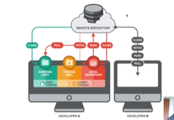

# <u>**What will we learn today**</u>

1. ## Introduce version control, git and github 

2. ## Install git in window computer!

3. ## Basic: create github account, github repository

4. ## pull and push

5. ## Advance:

- ### 	Branch, merge

- ### 	Conflict resolving, pull request

1. ## Introduce version control, git and github

   ***Version control***

   When you run a project with your team, there are many participant join  and code the project.  Today it work so tomorrow someone adjust so it conflict, can't working exactly. So it arise  a problem we need to manage our project, who add code, who delete code, how to roll back to the previous state.... version control was born to solve the problems. 

   ***Git***

   Git is version-control system to  handle everything from to very large project with speed and efficiency.

   Git was launched in 2005 with linuxs torvald is author.

   All code and history is store at user 's local computer

   3 important definition: repo, commit and branch.

   ***github***

   github is a git repository hosting service. it allow you store your code, and work with git.

2. ## Install github in window computer.

   Step 1: download installed file in home git web  [desktop.github.com](https://desktop.github.com/).

   Step 2: click download for windows 64bit

   Step 3: run installation file.

   that is, you complete the installed process.

3. ### Several popular git command 

   git clone

   git init

   git pull

   git add

   git add .

   git commit //add to local repository

   git push

   git log or git status // check status of file whether file was add to repo or not

   git log -decorate -graph -oneline

4. git architecture

   

5. 

